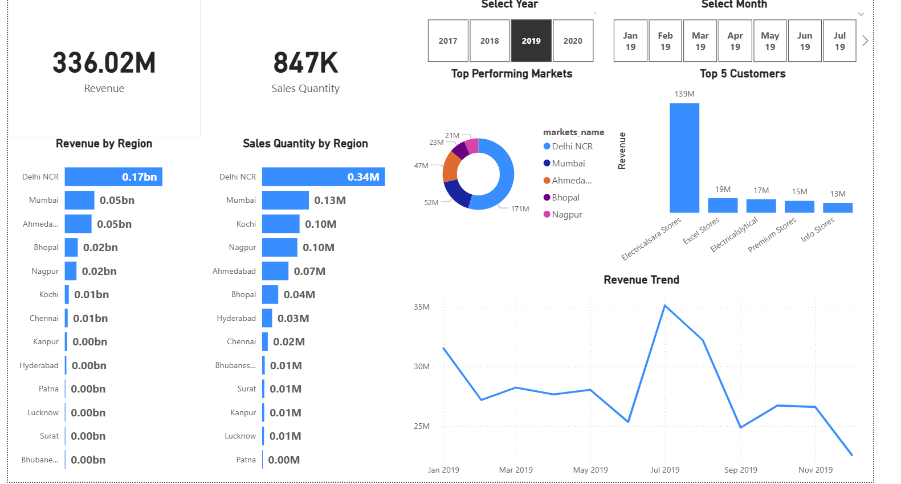

# Sales Data Pipeline and Dashboard  

## 📌 Overview  
This project demonstrates the end-to-end development of a sales analytics pipeline and dashboard for a computer hardware business. The goal was to streamline reporting, track key sales KPIs, and generate actionable insights for decision-makers.  

- Engineered a robust SQL pipeline in MySQL to process and analyze **1M+ sales records**  
- Designed and automated Power BI dashboard to track critical sales KPIs in real time  
- Transformed raw transactional data into meaningful insights through **ETL** processes and advanced **DAX calculations**  
- Enabled business leaders to monitor revenue, top customers, and market performance dynamically  
- Improved reporting timeliness and accuracy, accelerating decision-making across the organization  

---

## ⚙️ Tech Stack  
- **SQL (MySQL):** Data extraction, transformation, and query building  
- **Power BI:** Data cleaning, modeling, KPI tracking, and dashboard design with DAX  
- **Excel:** Quick validation and exploratory data analysis  

---

## 🔑 Key Features  
- Designed **SQL pipelines** to process **1M+ sales records**  
- Built **automated Power BI dashboards** to track:  
  - Revenue & sales quantities by region  
  - Top customers and top-performing markets  
  - Revenue trend analysis  
- Implemented **ETL workflows in Power BI** (currency normalization, missing value handling)  
- Used **advanced DAX calculations** for KPI metrics and time intelligence functions  
- Enabled **real-time alerts** for business-critical thresholds  

---

## 📊 Dashboard Preview  
  

---

## 🚀 How to Use  
1. Import the provided SQL dataset into a MySQL server.  
2. Run queries from the `sql/` folder to validate and explore the data.  
3. Open `SalesDashboard.pbix` in Power BI Desktop and connect it to the dataset.  
4. Explore the interactive dashboard and insights.  

---

## 📈 Insights Gained  
- **Delhi NCR** was the top-performing region, generating **0.17bn revenue**  
- **Electricalsara Stores** contributed the highest revenue (~139M)  
- Revenue showed noticeable seasonality with peaks in **July 2019**  

---

## 📌 Learning Outcomes  
- Experience in **end-to-end BI project execution** (data discovery → ETL → visualization)  
- Hands-on skills in **data cleaning, modeling, and visualization** with Power BI  
- Strengthened understanding of **SQL pipelines** and their integration with BI tools  

---

## 🔮 Future Enhancements  
- **Cloud Migration**: Host the database on AWS RDS or Azure SQL for scalability  
- **Scheduled ETL**: Automate refreshes with Apache Airflow or Power Automate  
- **Predictive Analytics**: Build forecasting models to project sales trends  
- **Role-Based Access**: Deploy dashboards with access control for stakeholders  

---

